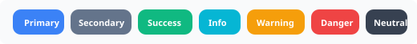
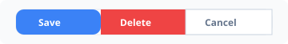

# NovaReact

A modular React UI component library — import only what you need.

```bash
npm install nova-react
```

## Components

| Component | Import | Documentation |
|-----------|--------|---------------|
| **AutoComplete** | `nova-react/autocomplete` | [📖 Docs](./docs/autocomplete.md) |
| **Button** | `nova-react/button` | [📖 Docs](./docs/button.md) |

## AutoComplete

```jsx
import { useState } from 'react';
import { AutoComplete } from 'nova-react/autocomplete';
import 'nova-react/autocomplete/styles.css';

function App() {
  const [value, setValue] = useState('');

  return (
    <AutoComplete
      value={value}
      options={['Germany', 'Iran', 'France']}
      onChange={(e) => setValue(e.value)}
      placeholder="Search..."
    />
  );
}
```

[📖 Full documentation with all props & examples](./docs/autocomplete.md)

---

## All Usage Modes

### 1. Basic — static options with filter & highlight

```jsx
<AutoComplete
  options={countries}
  value={value}
  onChange={(e) => setValue(e.value)}
  placeholder="Search country..."
  showClear
  highlightMatches
/>
```


---

### 2. Dropdown Button

```jsx
<AutoComplete dropdown options={countries} value={value} onChange={(e) => setValue(e.value)} />
```


---

### 3. Objects with Custom Template

```jsx
<AutoComplete
  field="name"
  options={countryObjects}
  itemTemplate={(c) => (
    <div style={{ display: 'flex', justifyContent: 'space-between' }}>
      <span>{c.name}</span>
      <span>{c.code} · {c.continent}</span>
    </div>
  )}
  value={value}
  onChange={(e) => setValue(e.value)}
/>
```


---

### 4. Multiple Selection

```jsx
<AutoComplete multiple options={tags} value={value} onChange={(e) => setValue(e.value)} selectionLimit={5} />
```


---

### 5. Grouped Options

```jsx
<AutoComplete
  options={groupedCities}
  optionGroupLabel="label"
  optionGroupChildren="items"
  value={value}
  onChange={(e) => setValue(e.value)}
/>
```


---

### 6. Force Selection

```jsx
<AutoComplete forceSelection options={countries} value={value} onChange={(e) => setValue(e.value)} />
```


---

### 7. Float Label

```jsx
<AutoComplete floatLabel label="Search country" options={countries} value={value} onChange={(e) => setValue(e.value)} />
```


---

### 8. Allow Custom Value

```jsx
<AutoComplete allowCustomValue options={tags} value={value} onChange={(e) => setValue(e.value)} />
```


---

### 9. Virtual Scroll (5000+ items)

```jsx
<AutoComplete
  dropdown
  options={bigList}
  virtualScrollerOptions={{ itemSize: 38 }}
  value={value}
  onChange={(e) => setValue(e.value)}
/>
```


---

### 10. Async Search (API)

```jsx
<AutoComplete
  suggestions={suggestions}
  completeMethod={search}
  value={value}
  onChange={(e) => setValue(e.value)}
  loading={loading}
  minLength={2}
  delay={300}
/>
```


---

### 11. Invalid / Error State

```jsx
<AutoComplete
  label="Required Field"
  options={countries}
  value={value}
  onChange={(e) => setValue(e.value)}
  invalid={!value}
  errorMessage="This field is required"
/>
```


---

### 12. Sizes (sm / md / lg)

```jsx
<AutoComplete size="sm" options={countries} placeholder="Small" />
<AutoComplete size="md" options={countries} placeholder="Medium" />
<AutoComplete size="lg" options={countries} placeholder="Large" />
```


---

### 13. Disabled

```jsx
<AutoComplete disabled options={countries} placeholder="Disabled" />
```


### 14. RTL · 15. Portal · 16. Match Mode · 17. Disabled Options · 18. Creatable

```jsx
<AutoComplete rtl options={['ایران', 'آلمان']} placeholder="جستجو..." />
<AutoComplete appendTo="body" dropdown options={countries} />
<AutoComplete matchMode="startsWith" options={countries} />
<AutoComplete options={[{ name: 'Iran' }, { name: 'Germany', disabled: true }]} field="name" />
<AutoComplete allowCustomValue options={tags} placeholder="Type a new tag..." />
```

---

## Button

```jsx
import { Button, ButtonGroup, ToggleButton, SplitButton } from 'nova-react/button';
import 'nova-react/button/styles.css';

<Button label="Submit" />
<Button label="Get Started" variant="gradient" raised />
<Button label="Help" tooltip="More info" color="#8b5cf6" />
```

[📖 Full Button documentation](./docs/button.md)

### Basic & Severity

```jsx
<Button label="Submit" />
<Button label="Success" severity="success" />
<Button label="Danger" severity="danger" variant="outlined" />
```




### Gradient & Loading

```jsx
<Button label="Get Started" variant="gradient" raised />
<Button label="Save" loading loadingText="Saving..." />
```


### Badges & Button Group

```jsx
<Button label="Emails" badge="8" />
<ButtonGroup attached>
  <Button label="Save" />
  <Button label="Delete" severity="danger" />
  <Button label="Cancel" severity="secondary" variant="outlined" />
</ButtonGroup>
```




### Toggle, Split, Tooltip, Color & RTL

```jsx
<ToggleButton label="Bold" variant="outlined" pressed={bold} onChange={(e) => setBold(e.pressed)} />

<SplitButton label="Save" model={[{ label: 'Delete', severity: 'danger', command: () => {} }]} />

<Button label="Help" tooltip="More info" tooltipPosition="top" />
<Button label="Brand" color="#8b5cf6" />
<Button label="ثبت" rtl icon={<CheckIcon />} />
```


---

## Development

```bash
npm install
npm run demo      # run demo locally
npm run test      # run unit tests
npm run build     # build for npm publish
```

## License

[MIT](./LICENSE)
